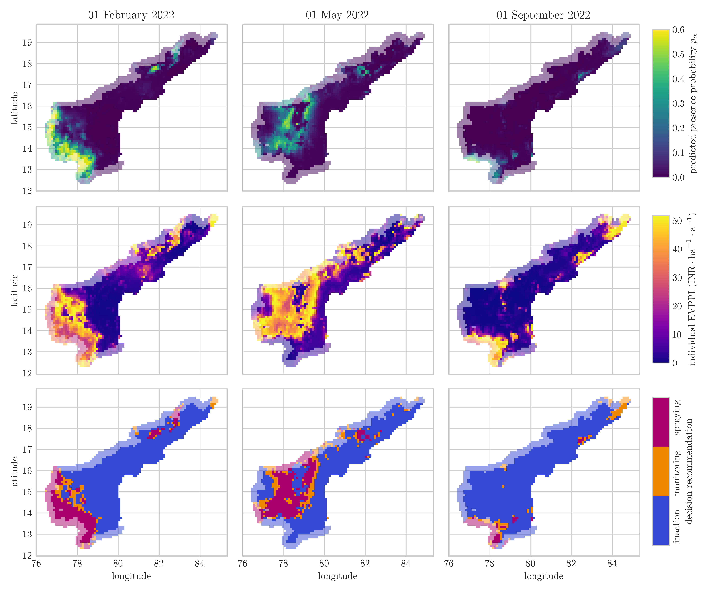

# Model code and supplementary for pest risk decision paper

Full paper: **"Combining spatio-temporal pest risk prediction and decision theory to improve pest management in smallholder agriculture"** (under review)

Runnable code files:

* [Notebook for training, validation and inference](https://github.com/johanneskopton/pest-risk-decision/blob/main/run_pest_risk_model.ipynb) 
* [the pest risk model implementation](https://github.com/johanneskopton/pest-risk-decision/blob/main/gp_model.py)
* [visualization of the decision model](https://github.com/johanneskopton/pest-risk-decision/blob/main/decision_model_vis.py)
* [analysis of the Monte Carlo simulation](https://github.com/johanneskopton/pest-risk-decision/blob/main/mc_analysis.ipynb)
* [covariogram generation](https://github.com/johanneskopton/pest-risk-decision/blob/main/covariogram.ipynb)
* [analyze feature importance](https://github.com/johanneskopton/pest-risk-decision/blob/main/feature_importance.ipynb)

Other code files for transparency (in `auxiliary`):

* `create_synthetic_dataset.ipynb` for the creation of the synthetic dataset from the original non-public dataset
* `gee_extraction.ipynb` for downloading the weather data from Google Earth Engine
* `population analysis.ipynb` for the Monte Carlo simulation for assessing the community EVPI and possible benefits on community level
* `preprocess_weather_data.ipynb` for processing the raw ECMWF/ERA5 weather data from GEE into 30-day time series to be used as covariates

